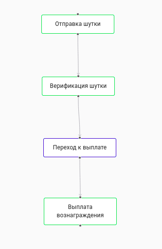
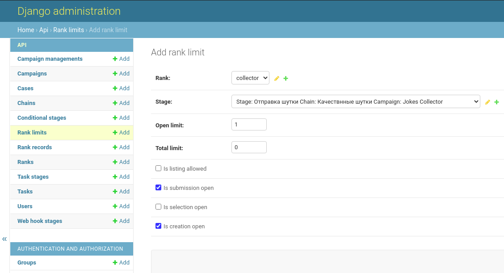
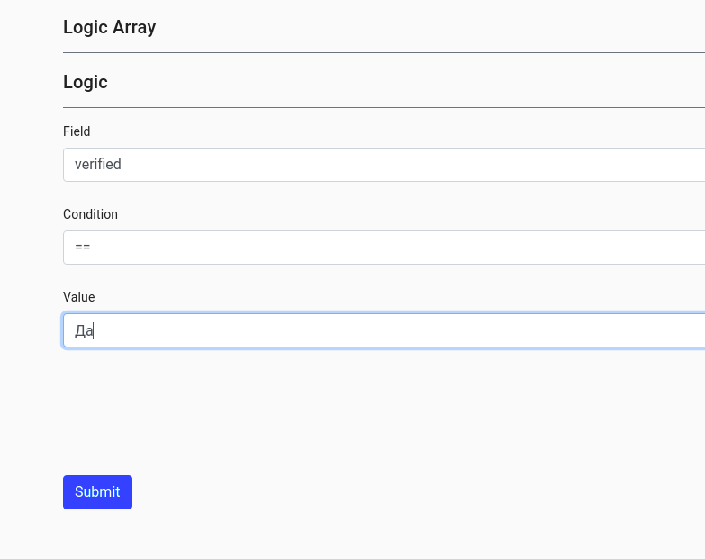
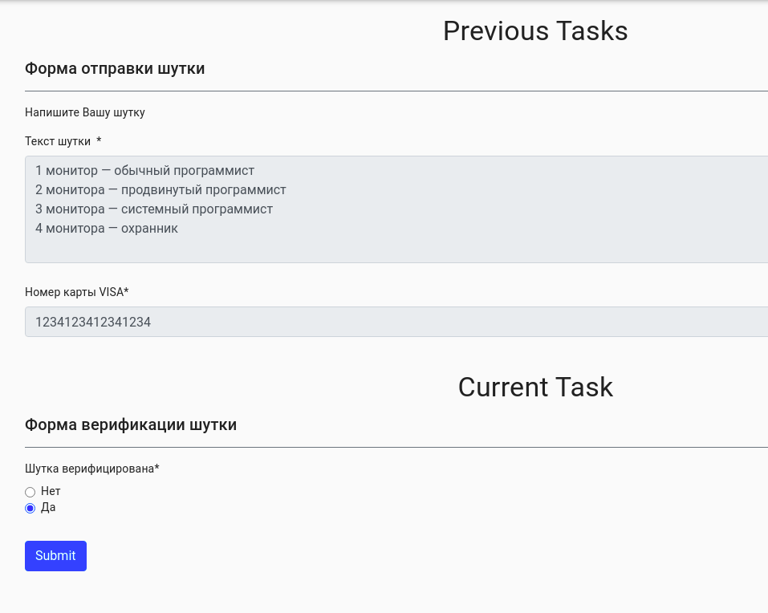

О программе
===========

Вступление
----------

Привет, мой дорогой друг! Каждую секунду в мире появляются миллионы, а возможно даже и миллиарды различных задач: от довольно простых "Вскипятить чайник с водой" до невероятно сложных, например таких как "Создать и запустить свой спутник в космос"

Необходимо много времени чтобы четко сформулировать каждую задачу, найти ответственного за выполнение этой задачи, а также проконтролировать её выполнение. Кроме этого, каждая задача может быть лишь маленьким звеном очень длинной цепи задач, а все эти цепи могут быть частью одной большой Кампании (не путать с "Компанией")

С помощью нашего комплекса приложений ты сможешь легко создавать и контролировать свои "Кампании", которые сделают наш Мир намного лучше!

Основные возможности
--------------------

1. Создание собственных форм задач под нужды Кампании
2. Объединение задач в одну логическую последовательность (в виде цепочек задач)
3. Автоматическое назначение задач пользователям в зависимости от логики

Демонстрация
------------

В качестве примера мы создадим с тобой Кампанию по сбору веселых шуток, где любой желающий сможет отправить нам свою шутку и если она окажется "качественной", то мы выплатим ему вознаграждение (например 1$)

*Основыне элементы Кампании: (пользователи и формы)*

1. **Менеджер кампании** (пользователь который настраивает в системе основные механизмы Кампании)
2. **Сборщик шуток** (пользователь который собирает шутки, шутки может собирать любой человек, для этого он должен быть зарегистрирован в системе Кампании через свою почту)
3. **Верификатор шуток** (пользователь который отбирает "качественные" шутки)
4. **Бухгалтер** (пользователь который осуществляет выплату вознаграждений)

5. **Форма** отправки шутки
6. **Форма** верификации шутки
7. **Форма** подтверждения выплаты вознаграждения

Итак, ты готов к установке приложений! Чтобы начать установку перейди в меню **Installation**

DEMO: Screenshots
-----------------

